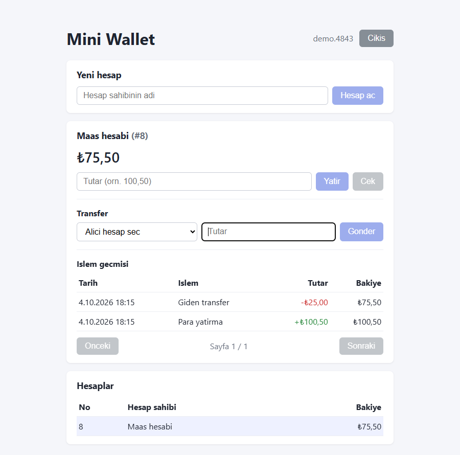

# Mini Wallet

[](https://github.com/ilaydayrdmc/mini-wallet/actions/workflows/ci.yml)

Küçük bir dijital cüzdan uygulaması: hesap aç, para yatır, para çek, hesaplar arası transfer yap ve işlem geçmişini gör.

Spring Boot ile yazılmış katmanlı bir REST API, React arayüzü ve PostgreSQL'den oluşur. Tamamı Docker ile tek komutla ayağa kalkar.

<!--
Ekran görüntüsü eklemek için: görüntüyü docs/screenshot.png olarak kaydet ve bu satırı aç.

-->

## Özellikler

- Hesap açma ve listeleme
- Para yatırma ve çekme (yetersiz bakiye kontrolüyle)
- Hesaplar arası transfer (tek veritabanı transaction'ı içinde)
- Sayfalı, en yeniden eskiye işlem geçmişi (her kayıtta işlem sonrası bakiye)
- Doğrulama ve standart (RFC 7807 `ProblemDetail`) hata yanıtları

## Teknolojiler

| Katman | Teknoloji |
|---|---|
| Backend | Java 17, Spring Boot 4, Spring Web, Spring Data JPA (Hibernate), Bean Validation |
| Veritabanı | PostgreSQL 16, Flyway (migration) |
| Frontend | React 19, Vite |
| Test | JUnit 5, Mockito, AssertJ, Testcontainers |
| Altyapı | Docker, Docker Compose (Nginx ile frontend), Maven Wrapper |
| CI | GitHub Actions (backend testleri + frontend lint/build) |

## Hızlı başlangıç

Gereken tek şey [Docker](https://www.docker.com/products/docker-desktop/).

```bash
git clone https://github.com/ilaydayrdmc/mini-wallet.git
cd mini-wallet
docker compose up -d --build
```

| Servis | Adres |
|---|---|
| Arayüz | http://localhost:3000 |
| API | http://localhost:8080/api |
| PostgreSQL | `localhost:5432` (kullanıcı/şifre/veritabanı: `wallet`) |

Durdurmak için `docker compose down`. Verileri de silmek için `docker compose down -v`.

## Geliştirme ortamı

Docker yerine kodu yerelde çalıştırmak için JDK 17 ve Node.js 20.19+ (veya 22.12+) gerekir. Maven kurulumu gerekmez, Maven Wrapper kullanılır.

```bash
# 1. Sadece veritabanını başlat
docker compose up -d db

# 2. Backend (http://localhost:8080)
cd backend
./mvnw spring-boot:run          # Windows: .\mvnw.cmd spring-boot:run

# 3. Frontend (http://localhost:5173), başka bir terminalde
cd frontend
npm install
npm run dev
```

Vite geliştirme sunucusu `/api` isteklerini `localhost:8080`'e iletir, bu yüzden CORS ayarı gerekmez. Docker kurulumunda aynı işi Nginx yapar.

## Testler

```bash
cd backend
./mvnw test          # Windows: .\mvnw.cmd test
```

Testler çalışırken **Docker çalışıyor olmalıdır**: entegrasyon testleri [Testcontainers](https://testcontainers.com/) ile geçici bir PostgreSQL container'ı başlatır, ayrıca veritabanı kurmak gerekmez.

- `AccountServiceTest` ve `TransferServiceTest`: Mockito ile servis katmanı birim testleri (yatırma, çekme, transfer, yetersiz bakiye, olmayan hesap, kilit sırası).
- `ConcurrencyIntegrationTest`: gerçek PostgreSQL üzerinde eşzamanlılık testleri. Aynı hesaba eşzamanlı yatırmada güncelleme kaybolmaz, eşzamanlı çekmeler bakiyeyi eksiye düşüremez, karşılıklı transferler (A→B ve B→A) deadlock yapmaz ve toplam para korunur. Satır kilidi (`FOR UPDATE`) kaldırıldığında bu üç test kırılır.
- `WalletApplicationTests`: uygulama bağlamının yüklendiğini doğrular. Flyway migration'ları boş bir veritabanına uygulanır ve Hibernate şema doğrulaması geçer.

Frontend için: `cd frontend && npm run lint && npm run build`.

## API

Temel adres: `/api`. İstek ve yanıtlar JSON'dur.

| Metot | Yol | Açıklama |
|---|---|---|
| `GET` | `/hello` | Basit sağlık denemesi |
| `POST` | `/accounts` | Hesap açar. Gövde: `{"ownerName": "Ayşe"}` |
| `GET` | `/accounts` | Hesapları listeler |
| `POST` | `/accounts/{id}/deposit` | Para yatırır. Gövde: `{"amount": 100.50}` |
| `POST` | `/accounts/{id}/withdraw` | Para çeker. Gövde: `{"amount": 40}` |
| `POST` | `/transfers` | Transfer. Gövde: `{"fromAccountId": 1, "toAccountId": 2, "amount": 25}` |
| `GET` | `/accounts/{id}/transactions?page=0&size=20` | Sayfalı işlem geçmişi (`size` en fazla 100) |

Hata durumları:

| Durum | HTTP kodu |
|---|---|
| Geçersiz istek (boş isim, tutar < 0.01, hatalı sayfa parametresi) | `400` |
| Kendi hesabına transfer | `400` |
| Hesap bulunamadı | `404` |
| Yetersiz bakiye | `422` |

Örnek:

```bash
curl -X POST http://localhost:8080/api/accounts \
  -H "Content-Type: application/json" -d '{"ownerName":"Ayşe Yılmaz"}'

curl -X POST http://localhost:8080/api/accounts/1/deposit \
  -H "Content-Type: application/json" -d '{"amount":100.50}'
```

## Mimari

```
mini-wallet/
├── backend/                       Spring Boot uygulaması
│   └── src/main/java/com/miniwallet/wallet/
│       ├── controller/            HTTP katmanı (istek/yanıt)
│       ├── service/               İş mantığı ve transaction sınırları
│       ├── repository/            Spring Data JPA arayüzleri
│       ├── entity/                Veritabanı tabloları (Account, Transaction)
│       ├── dto/                   API giriş/çıkış modelleri
│       └── exception/             Özel hatalar ve global hata yakalayıcı
├── frontend/                      React + Vite arayüzü
│   └── src/
│       ├── api.js                 Backend ile konuşan tek yer
│       └── components/            Hesap listesi, panel, transfer, geçmiş
├── docker-compose.yml             db + app + frontend
└── .github/workflows/ci.yml       CI
```

İstek akışı: `Controller → Service → Repository → PostgreSQL`. Entity'ler API'ye doğrudan açılmaz, her uç nokta kendi DTO'sunu kullanır.

### Tasarım kararları

- **Para tutarları `BigDecimal`** ile (`NUMERIC(19,2)`) tutulur ve karşılaştırılır, `double` kullanılmaz.
- **Tek transaction:** Yatırma, çekme ve transfer `@Transactional` içindedir. Bakiye güncellemesi ve işlem kaydı birlikte kaydedilir ya da hiç kaydedilmez.
- **Pessimistic locking:** Bakiye değiştiren işlemler hesabı `SELECT ... FOR UPDATE` ile kilitler. Aynı hesaba eşzamanlı işlemler sırayla yapılır, güncellemeler birbirini ezmez.
- **Deadlock önleme:** Transferde iki hesap her zaman küçük id'den büyüğe doğru kilitlenir. Karşılıklı transferler (A→B ve B→A) birbirini beklemez. Bu davranış birim testle korunur.
- **Şema Flyway ile yönetilir** (`backend/src/main/resources/db/migration`). Hibernate yalnızca `validate` modunda çalışır, tabloları kendisi oluşturmaz veya değiştirmez. İşlem geçmişi sorgusu için bileşik bir indeks tanımlıdır.
- **İşlem geçmişi** her kayıtta `balanceAfter` saklar, böylece geçmiş görüntülenirken bakiye yeniden hesaplanmaz.

## Bilinen sınırlar

- **Kimlik doğrulama yok.** Herkes her hesapta işlem yapabilir.
- Veritabanı şifreleri yerel geliştirme içindir (`wallet/wallet`), `docker-compose.yml` içinde açıkça yazılıdır.
- Para birimi yalnızca arayüzde ₺ olarak gösterilir, backend para birimi tutmaz.
